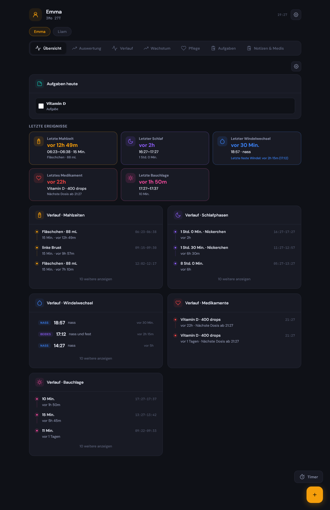
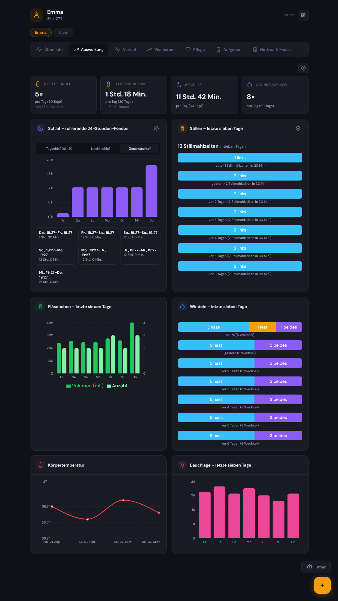
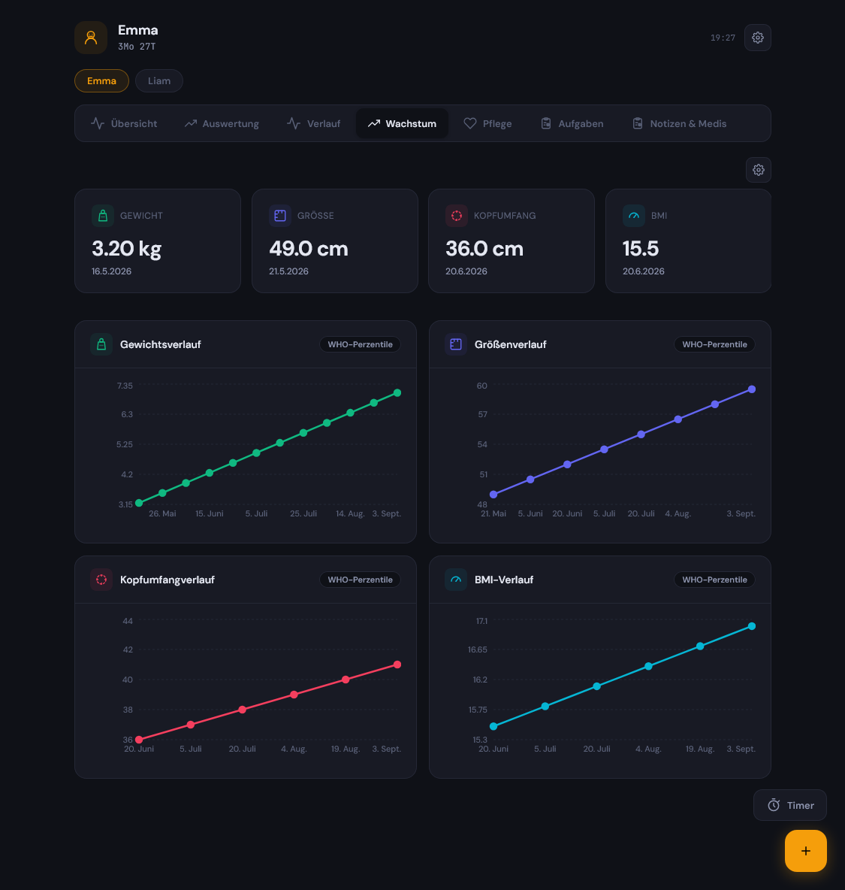
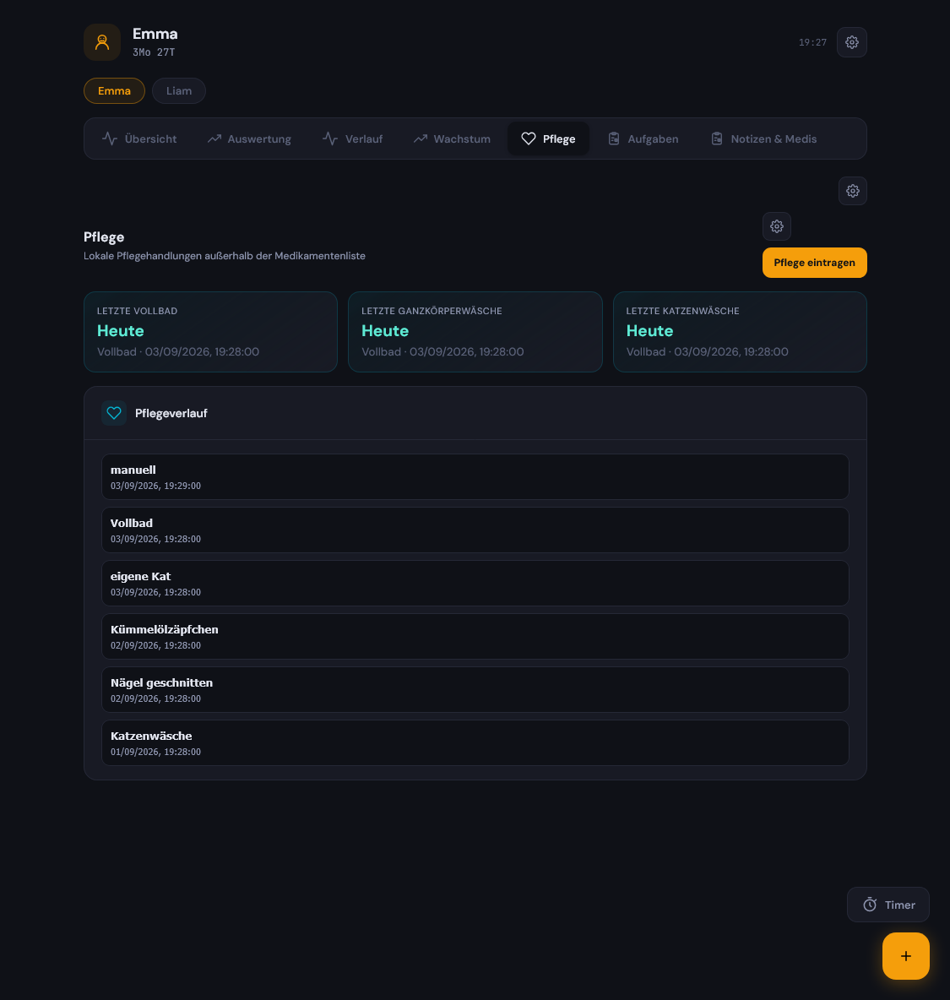
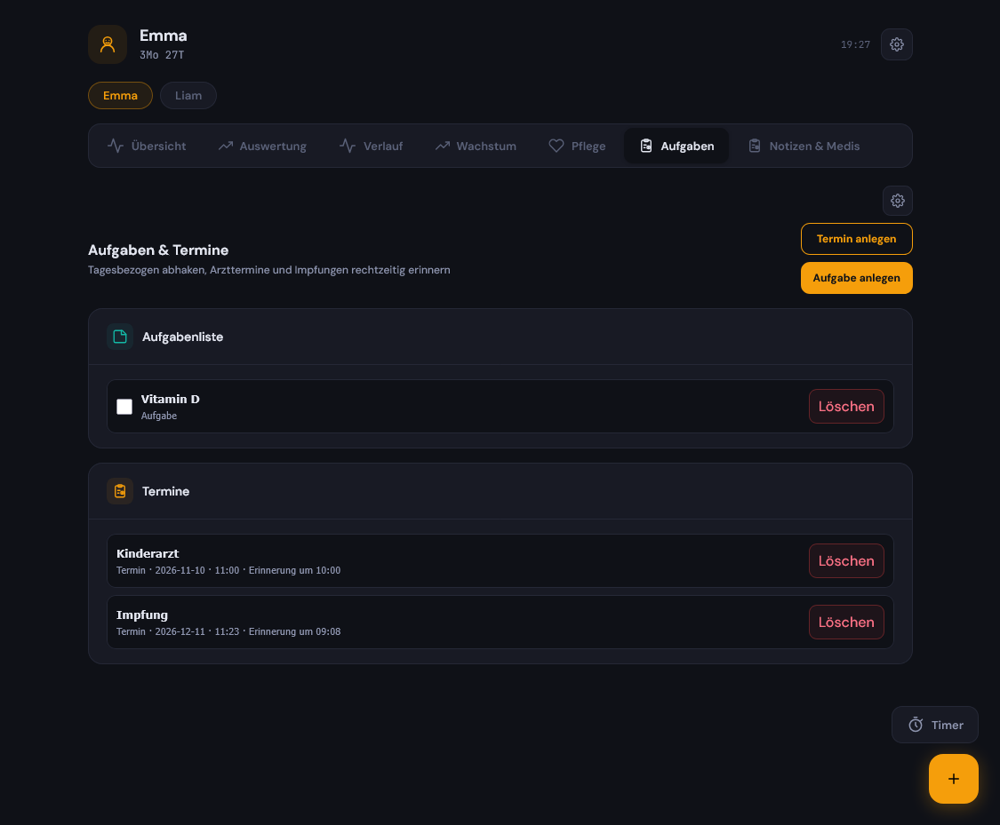
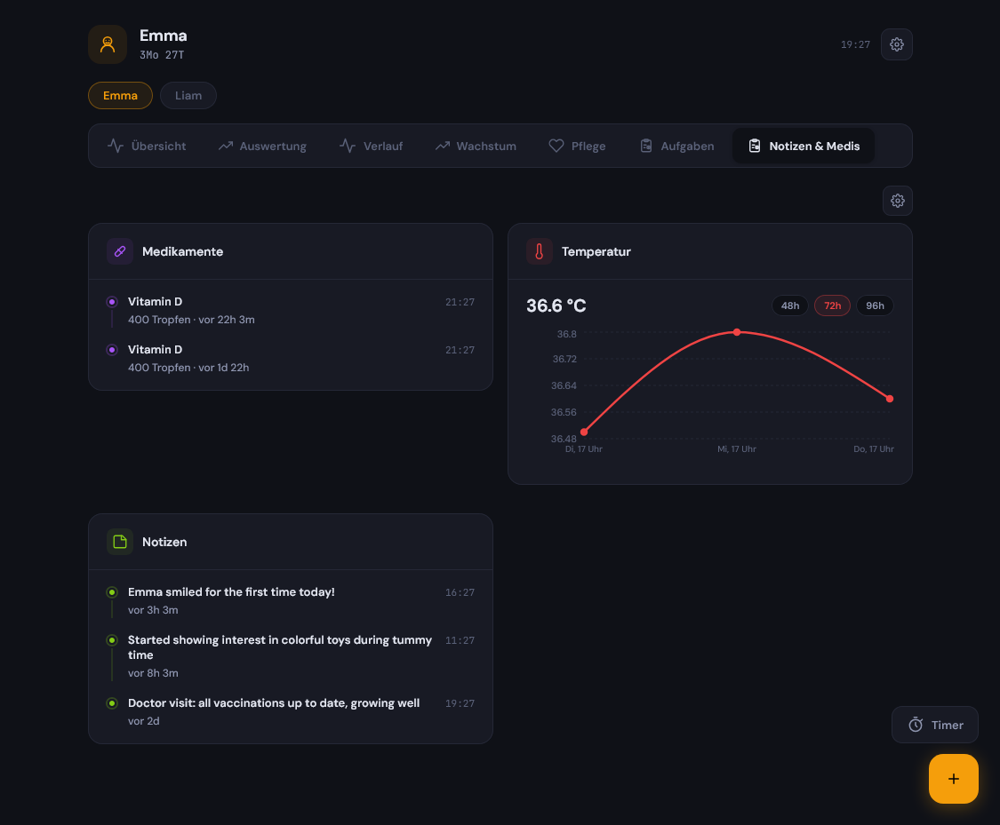
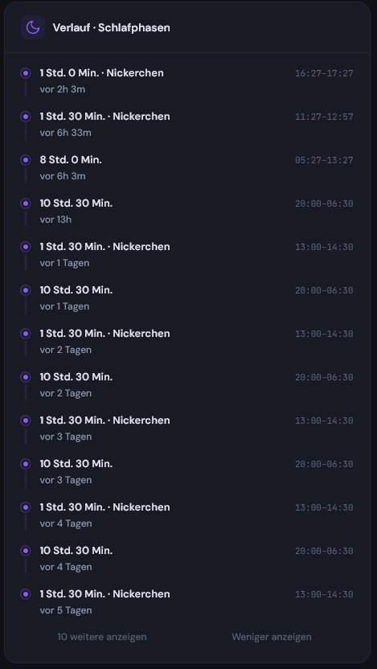

# Baby Buddy Dashboard Plus

[Deutsch](#deutsch) · [English](#english) · [Roadmap](ROADMAP.md) · [Development](DEVELOPMENT.md) · [Release process](RELEASING.md) · [Baby Buddy – data source](https://github.com/babybuddy/babybuddy) · [Upstream dashboard](https://github.com/mbentancour/baby-buddy-dashboard)

> An independent community fork of Baby Buddy Dashboard. **Baby Buddy Dashboard Plus 2.3.2 is based on Baby Buddy Dashboard 1.7.7.** Changes made in the upstream project after 1.7.7 are not included automatically; they are evaluated and ported deliberately.

---

## Screenshots

All screenshots use the built-in Baby Buddy demo data. / Alle Screenshots verwenden die integrierten Baby-Buddy-Demodaten.

### Overview / Übersicht

Configurable recent-event cards, a daily task, compact history cards and quick actions in one view.<br>
Konfigurierbare Karten für letzte Ereignisse, eine Tagesaufgabe, kompakte Verlaufskarten und Schnellerfassungen in einer Ansicht.



### Analytics / Auswertungen

Colour-consistent feeding, bottle, diaper, sleep, temperature and tummy-time analytics, including non-overlapping rolling 24-hour sleep windows.<br>
Farbliche konsistente Auswertungen für Stillen, Fläschchen, Windeln, Schlaf, Temperatur und Bauchlage – einschließlich nicht überlappender rollierender 24-Stunden-Schlaffenster.



### Growth / Wachstum

Weight, height, head circumference and automatically calculated BMI in one place; optional WHO percentile overlays can be enabled per chart.<br>
Gewicht, Größe, Kopfumfang und automatisch berechneter BMI an einem Ort; optionale WHO-Perzentilkurven können je Diagramm eingeblendet werden.



### Care tracker / Pflege-Tracker

Care history supports bathing and washing hierarchy, nail trimming, custom categories and direct entry editing.<br>
Der Pflegeverlauf unterstützt Bade- und Waschhierarchien, Nägel schneiden, eigene Kategorien und die direkte Bearbeitung von Einträgen.



### Tasks and appointments / Aufgaben und Termine

Recurring tasks and one-off appointments are separate, with an appointment time and a scheduled reminder.<br>
Wiederkehrende Aufgaben und einmalige Termine sind getrennt; Termine besitzen eine Uhrzeit und eine zeitgesteuerte Erinnerung.



### Notes and medication / Notizen und Medikamente

Medication history, notes and a compact, selectable temperature trend stay together without overloading the page.<br>
Medikamentenverlauf, Notizen und ein kompaktes auswählbares Temperaturdiagramm bleiben zusammen, ohne die Seite zu überladen.



### Browsable timeline / Durchblätterbarer Verlauf

The timeline groups a day's sleep, feeding, diaper and other events in chronological order, with incremental loading for longer histories.<br>
Der Verlauf fasst Schlaf-, Fütterungs-, Windel- und weitere Ereignisse eines Tages chronologisch zusammen und lädt längere Listen schrittweise nach.



## Deutsch

### Was ist Baby Buddy Dashboard Plus?

Baby Buddy Dashboard Plus ist ein erweitertes Home-Assistant-Dashboard für [Baby Buddy](https://github.com/babybuddy/babybuddy), die eigentliche Anwendung für Erfassung und Datenhaltung von Mahlzeiten, Schlaf, Windeln, Medikamenten und Wachstum. Plus verbindet sich über den Baby-Buddy-API-Schlüssel mit einer bestehenden Instanz und ergänzt das ursprüngliche [Baby Buddy Dashboard](https://github.com/mbentancour/baby-buddy-dashboard) um ausführlichere Auswertungen, Pflege- und Alltagsorganisation, bearbeitbare Verläufe sowie weitreichende Personalisierung. Pflege, Aufgaben und Termine sind zusätzliche, lokal im geschützten Home-Assistant-App-Datenverzeichnis gespeicherte Plus-Funktionen.

Die Plus-Version wird als eigenständige App mit dem Slug `baby-buddy-dashboard-plus` installiert. Sie ersetzt weder Baby Buddy noch zwingend das originale Dashboard: Beide können parallel installiert sein. Die Bezeichnung in der Home-Assistant-Seitenleiste lässt sich im Dashboard zwischen **„Baby Buddy Dashboard Plus“** und dem Namen des in Baby Buddy ausgewählten Kindes umschalten.

### Basis und Abgrenzung zum Original

Dieses Projekt baut auf **Baby Buddy Dashboard 1.7.7** von [Martin Bentancour](https://github.com/mbentancour/baby-buddy-dashboard) auf. Die ursprüngliche MIT-Lizenz und die Urheberhinweise bleiben erhalten. Baby Buddy Dashboard Plus ist kein offizielles Baby-Buddy- oder Home-Assistant-Projekt und steht in keiner Verbindung zu den jeweiligen Maintainer:innen.

| Bereich | Baby Buddy Dashboard 1.7.7 | Baby Buddy Dashboard Plus |
| --- | --- | --- |
| Übersicht | Kompaktes Tages-Dashboard | Konfigurierbare Karten, Reihenfolge und Sichtbarkeit je Bereich, „letzte Ereignisse“ und optionale Mini-Verläufe |
| Auswertungen | Grundlegende Tages- und Wochenansichten | Getrennte Still-, Fläschchen-, Windel-, Schlaf-, Temperatur- und Bauchlage-Auswertungen mit einheitlichem Farbschema |
| Schlaf | Tagesbezogene Darstellung | Nicht überlappende rollierende 24-Stunden-Fenster, Tag-/Nacht-/Gesamtschlaf und Vergleich über mehrere Tage |
| Verlauf | Kurzlisten auf der Übersicht | Eigener, tageweise durchblätterbarer Zeitstrahl mit Bearbeiten/Löschen der Einträge |
| Wachstum | Messwerte und Originalfunktionen | Automatische BMI-Ermittlung aus zeitnahen Größen- und Gewichtsmessungen, Wachstumskurven und optionale WHO-Überlagerungen |
| Pflege | Nicht vorhanden | Pflegeverlauf, Bade- und Wascharten, frei definierbare Kategorien, Erinnerungen und Pflege-Kopfbereich nach Wunsch |
| Aufgaben | Nicht vorhanden | Tagesaufgaben, Erinnerungen, Vitamin-D-ähnliche Routinen und einmalige Termine mit Uhrzeit |
| Benachrichtigungen | Add-on-Konfiguration | Auswahl von Home-Assistant-Notify-Diensten bzw. Media-Playern, Testbenachrichtigung und Sprachansagen |
| Vorrat | Nicht vorhanden | Optionaler Windelgrößen- und Vorratsrechner mit Gewichtstrend, Unter-/Erwartungs-/Obergrenze und Prognosedaten |
| Erscheinungsbild | Theme des Originalprojekts | Unabhängige Sprach- und Zeitformatwahl, mehrere Farbspektren, Hell/Dunkel/Pastell sowie zeitgesteuerter Themenwechsel |

### Zusätzliche Funktionen im Detail

- **Anpassbare Übersicht:** Karten können je Tab ein- oder ausgeblendet und in der gewünschten Reihenfolge angeordnet werden. Das betrifft auch die Einträge der Übersicht und die Auswahl im Pflege-Kopfbereich.
- **Ereigniskarten und Verlauf:** Letzte Mahlzeit, Windel, Schlaf, Medikament und Bauchlage zeigen Zeit, Dauer und relevante Details. Listen laden zunächst in handlichen Schritten; nach zwei Erweiterungen kann bei Bedarf alles angezeigt werden.
- **Korrekturen von Daten:** Vergangene Baby-Buddy-Einträge können über den Zeitstrahl aufgerufen, bearbeitet oder gelöscht werden. Auch ein reiner Hygiene-Windelwechsel ohne nass/fest lässt sich erfassen.
- **Detaillierte Fütterungsanalyse:** Stillmahlzeiten werden nach links/rechts und Dauer ausgewertet. Fläschchen erscheinen getrennt mit Menge, Anzahl oder Dauer. Eng aufeinanderfolgende Stillseiten werden für die Abstandsmetrik als zusammenhängende Mahlzeit behandelt.
- **Schlafanalyse:** Neben Kalendertagen steht ein Vergleich gleich langer, nicht überlappender Zeitfenster zur Verfügung. Damit bedeutet beispielsweise „vor 24–48 h“ tatsächlich die 24 Stunden vor dem aktuellsten Fenster und nicht eine aufsummierte 48-Stunden-Zahl.
- **Wachstum und Gesundheit:** Gewicht, Größe, Kopfumfang, BMI und Körpertemperatur werden in verständlichen Kurven dargestellt. Die BMI-Berechnung berücksichtigt auch Messungen, die am selben oder an einem nahe gelegenen Tag erfasst wurden. WHO-Referenzkurven können optional eingeblendet werden.
- **Pflege-Tracker:** Vollbad, Ganzkörperwäsche und Katzenwäsche sind hierarchisch eingeordnet: Ein Vollbad zählt auch als Ganzkörper- und Katzenwäsche, ohne dass die Anzeige widersprüchlich wird. Zusätzlich sind etwa Nägel schneiden, Kümmelöl, Kümmelölzäpfchen und frei benannte Pflegearten möglich. Einträge lassen sich im selben Dialog bearbeiten oder löschen.
- **Badeerinnerung:** Intervall und Uhrzeit für die Erinnerung an ein überfälliges Vollbad werden direkt in den Pflege-Einstellungen festgelegt.
- **Aufgaben und Termine:** Tägliche bzw. datumsbezogene Aufgaben können in der Übersicht erscheinen und nach dem Abhaken verschwinden. Einmalige Termine – etwa U-Untersuchungen oder Impfungen – besitzen einen eigenen Bereich, Terminzeit und eine Erinnerung am Termin- oder Vortag.
- **Medikamente und Notizen:** Regelmäßige Medikamente bleiben von Alltagsroutinen getrennt. Dosierung und nächstmögliche Gabe lassen sich erfassen; Notizen und Medikamentenverlauf bleiben übersichtlich und paginiert.
- **Benachrichtigungs-Test:** In den globalen Einstellungen können Notify-Dienste und optionale Media-Player ausgewählt, auf- und zugeklappt sowie mit einer frei zusammengesetzten Testmeldung geprüft werden. Die Uhrzeit wird unabhängig von der gewählten Sprache im 12- oder 24-Stunden-Format dargestellt.
- **Windelgrößen- und Vorratsrechner:** Nutzt standardmäßig überlappende Pampers-Gewichtsbereiche, die sich für andere Marken überschreiben lassen. Aus Gewichtstrend und tatsächlichem Verbrauch entstehen eine konservative Untergrenze, ein Erwartungswert und eine Obergrenze – jeweils mit voraussichtlichem Datum.
- **Mehrkind-Unterstützung:** Wenn die Baby-Buddy-API mehrere Kinder liefert, kann im Dashboard zwischen ihnen gewechselt werden. Persönliche Daten sind nicht im Quellcode oder im App-Namen fest verdrahtet.

### Installation über Home Assistant

1. In Home Assistant **Einstellungen → Apps → App-Store** öffnen.
2. Im Menü **Repositories** wählen und diese Repository-URL hinzufügen:

   ```text
   https://github.com/Biggim22/baby-buddy-dashboard-plus
   ```

3. **Baby Buddy Dashboard Plus** installieren und starten.
4. In der App-Konfiguration die URL deiner Baby-Buddy-Instanz und den API-Schlüssel eintragen.
5. Nach dem ersten Öffnen werden Sprache, Zeitformat, Darstellung, Benachrichtigungen und tab-spezifische Optionen direkt im Dashboard konfiguriert.

Die App benötigt Home Assistant ab der in [`config.yaml`](baby-buddy-dashboard-plus/config.yaml) angegebenen Version und eine erreichbare Baby-Buddy-Instanz mit API-Schlüssel. Die App speichert die Zugangsdaten nicht im Browser-Bundle; lokale Einstellungen, Aufgaben, Termine und Pflegeeinträge werden im geschützten App-Datenverzeichnis von Home Assistant abgelegt. Bitte behandle Sicherungen dieses Verzeichnisses trotzdem wie persönliche Familiendaten.

### Entwicklung und Lokaler Start

```bash
cp .env.example .env
# BABY_BUDDY_URL und BABY_BUDDY_API_KEY in .env setzen
./run_local.sh
```

Für einen Produktionsbuild:

```bash
cd baby-buddy-dashboard-plus/frontend
npm ci
npm run build
```

### Hinweise

- Das Dashboard ist eine Organisations- und Visualisierungshilfe, keine medizinische Beratung. Bei Fragen zu Medikamenten, Fieber, Ernährung oder Wachstum gilt immer die fachliche Einschätzung von Ärzt:innen bzw. Hebammen.
- Die App kann vorhandene Baby-Buddy-Daten ändern oder löschen, wenn diese Aktionen bewusst im Zeitstrahl oder in Bearbeitungsdialogen ausgelöst werden.
- Fehlerberichte und Verbesserungsvorschläge sind willkommen. Bitte niemals API-Schlüssel, interne URLs, Namen oder Gesundheitsdaten in Issues veröffentlichen.

---

## English

### What is Baby Buddy Dashboard Plus?

Baby Buddy Dashboard Plus is an extended Home Assistant dashboard for [Baby Buddy](https://github.com/babybuddy/babybuddy), the application responsible for entering and storing feedings, sleep, diapers, medication and growth data. It connects to an existing Baby Buddy instance through its API key and builds on the approachable [Baby Buddy Dashboard](https://github.com/mbentancour/baby-buddy-dashboard) interface with richer analytics, care and daily-life tracking, editable history, and extensive personalisation. Care, tasks and appointments are additional Plus features stored locally in Home Assistant's protected app-data directory.

Plus installs as a separate app with the `baby-buddy-dashboard-plus` slug. It does not replace Baby Buddy and does not require replacing the upstream dashboard; both can be installed in parallel. The Home Assistant sidebar label can be switched inside the dashboard between **“Baby Buddy Dashboard Plus”** and the selected child’s name.

### Upstream base and scope

This project is based on **Baby Buddy Dashboard 1.7.7** by [Martin Bentancour](https://github.com/mbentancour/baby-buddy-dashboard). The original MIT licence and attribution are retained. Baby Buddy Dashboard Plus is an independent community fork; it is not an official Baby Buddy or Home Assistant project and is not affiliated with either project’s maintainers.

Upstream changes released after version 1.7.7 are **not** automatically present in this fork. They are reviewed and ported deliberately so that the Plus-specific features stay reliable.

| Area | Baby Buddy Dashboard 1.7.7 | Baby Buddy Dashboard Plus |
| --- | --- | --- |
| Overview | Compact daily dashboard | Configurable cards, per-section order and visibility, last-event cards, optional compact trend charts |
| Analytics | Basic daily and weekly views | Separate breastfeeding, bottle, diaper, sleep, temperature, and tummy-time analytics with a consistent colour system |
| Sleep | Calendar-day presentation | Non-overlapping rolling 24-hour windows, day/night/total sleep, and multi-day comparisons |
| History | Short overview lists | Dedicated day-by-day, browsable timeline with edit and delete actions |
| Growth | Measurements and upstream features | Automatic BMI calculation from nearby height/weight measurements, growth charts, and optional WHO overlays |
| Care | Not available | Care history, bathing and washing types, custom categories, reminders, and configurable care header |
| Tasks | Not available | Daily tasks, reminders, vitamin-D-style routines, and one-off appointments with a time |
| Notifications | Add-on configuration | Select Home Assistant notify services and media players, test notifications, and optional voice announcements |
| Stock planning | Not available | Optional diaper-size and stock calculator using weight trend plus conservative, expected, and upper estimates |
| Appearance | Upstream theme | Independent language and time format, multiple colour spectra, light/dark/pastel themes, and scheduled theme switching |

### Plus features in detail

- **Customisable overview:** Cards can be shown, hidden and reordered per tab. The same approach applies to overview event groups and the care header.
- **Last-event cards and history:** Last feeding, diaper, sleep, medication and tummy time include time, duration and useful details. Long lists load in manageable steps; after two expansions, an explicit “show all” action is available.
- **Data corrections:** Past Baby Buddy records can be opened, edited or deleted from the timeline. A hygiene-only diaper change without wet/solid content can also be recorded.
- **Detailed feeding analytics:** Breastfeeding is evaluated by left/right side and duration. Bottles are shown separately by volume, count or duration. Closely spaced breast sides are treated as one feeding when calculating intervals.
- **Sleep analytics:** Alongside calendar days, Plus provides equal-length, non-overlapping rolling windows. “24–48 h ago” therefore means the 24 hours immediately before the latest window, not a cumulative 48-hour total.
- **Growth and health:** Weight, height, head circumference, BMI and body temperature are displayed in clear charts. BMI calculation also considers measurements entered on the same or nearby days. WHO reference curves can be enabled when desired.
- **Care tracker:** Full baths, full-body washes and quick washes follow a hierarchy: a full bath also counts as a full-body and quick wash, avoiding conflicting “last wash” values. Nail trimming, caraway oil, caraway suppositories and custom care types are supported. Edit and delete actions live together in the edit dialog.
- **Bath reminders:** The full-bath interval and reminder time are configured directly in the Care tab settings.
- **Tasks and appointments:** Daily or date-specific tasks can appear on the overview and disappear when completed. One-off appointments – for example check-ups or vaccinations – have their own section, appointment time, and a reminder on the appointment day or the day before.
- **Medication and notes:** Recurring medication stays separate from everyday routines. Dose and next allowed dose can be recorded while medication history and notes remain compact and paginated.
- **Notification testing:** Global settings provide collapsible selection of notify services and optional media players, plus a composable test message. The 12/24-hour time setting is independent from the selected language.
- **Diaper size and stock calculator:** Uses overlapping Pampers weight ranges by default, with editable ranges for other brands. Weight trend and real diaper use produce conservative minimum, expected and maximum estimates, each with a projected date.
- **Multiple children:** When the Baby Buddy API returns more than one child, the dashboard can switch between them. Personal names, addresses and health data are never hard-coded into the source or app title.

### Install through Home Assistant

1. Open **Settings → Apps → App Store** in Home Assistant.
2. Open **Repositories** from the menu and add:

   ```text
   https://github.com/Biggim22/baby-buddy-dashboard-plus
   ```

3. Install and start **Baby Buddy Dashboard Plus**.
4. Enter the URL of your Baby Buddy instance and its API key in the app configuration.
5. After first launch, configure language, time format, appearance, notifications and page-specific options from inside the dashboard.

The app requires the Home Assistant version declared in [`config.yaml`](baby-buddy-dashboard-plus/config.yaml) and a reachable Baby Buddy instance with an API key. Credentials are not embedded in the browser bundle. Local settings, tasks, appointments and care records live in Home Assistant’s protected app-data directory; backups of that directory should still be treated as personal family data.

### Development and local run

```bash
cp .env.example .env
# Set BABY_BUDDY_URL and BABY_BUDDY_API_KEY in .env
./run_local.sh
```

For a production build:

```bash
cd baby-buddy-dashboard-plus/frontend
npm ci
npm run build
```

### Notes

- This dashboard is an organisation and visualisation tool, not medical advice. For medication, fever, nutrition or growth questions, always follow qualified medical guidance.
- The app can change or delete existing Baby Buddy records only when those actions are deliberately requested from the timeline or an edit dialog.
- Bug reports and ideas are welcome. Never include API keys, internal URLs, names or health data in public issues.

## License and attribution

Baby Buddy Dashboard Plus is distributed under the [MIT License](LICENSE). It retains the attribution and licence of its upstream base, [Baby Buddy Dashboard](https://github.com/mbentancour/baby-buddy-dashboard), version 1.7.7. Baby Buddy itself is a separate project with its own licence and community.
